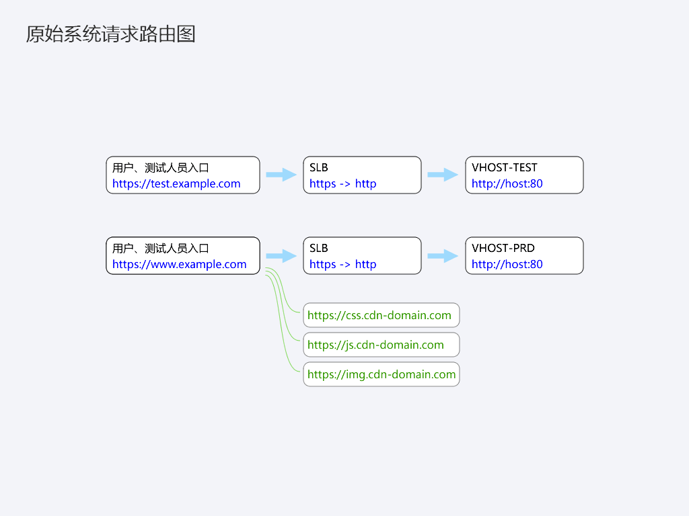
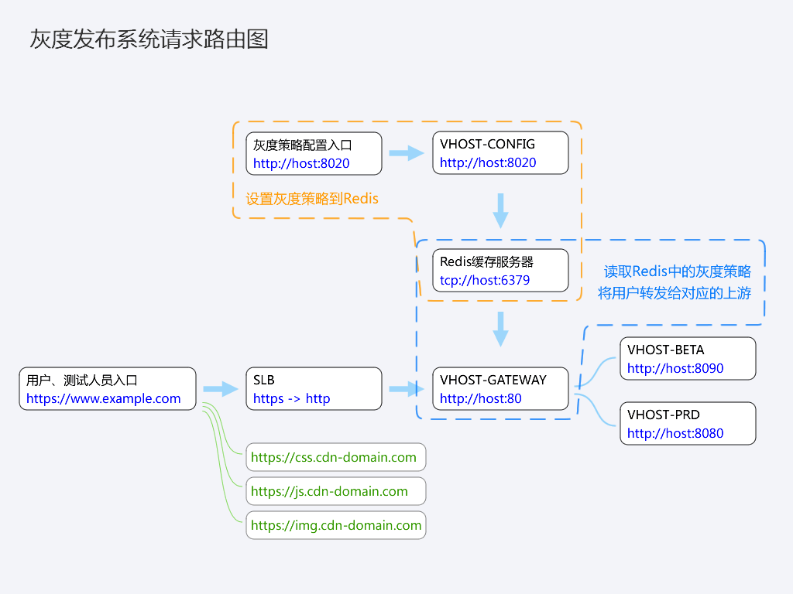
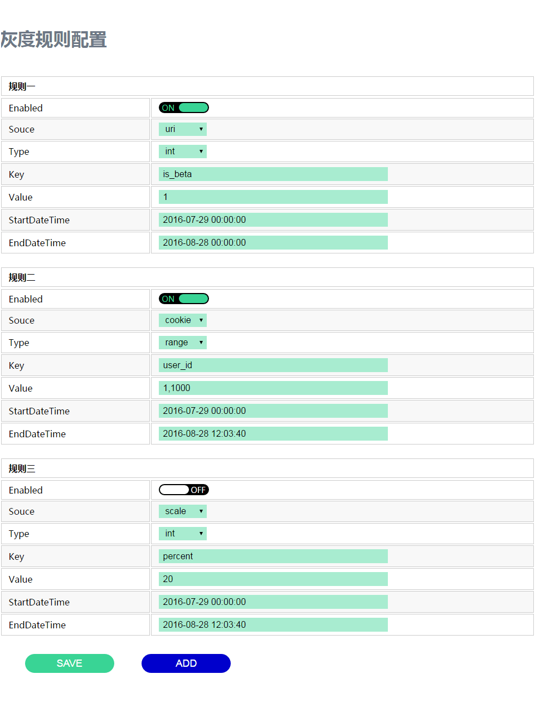
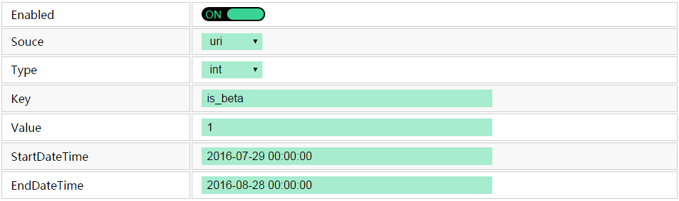
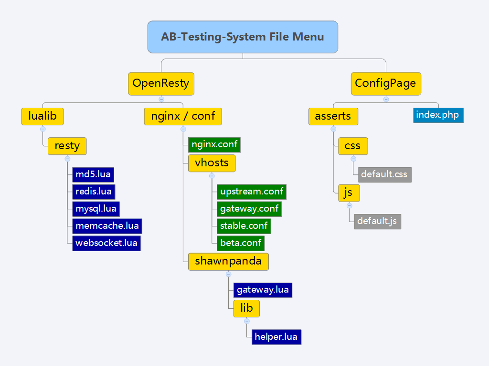

### 一、原始系统请求路由

 

### 二、灰度系统请求路由

 

### 三、规则配置
<pre><code class="hljs">浏览器访问 http://ip_address:8020/index.php</code></pre>

 

### 四、规则说明

<table>
  <thead>
    <tr>
      <th width="28%">字段</th>
      <th>说明</th>
    </tr>
  </thead>
  <tbody>
    <tr>
      <td>Enabled</td>
      <td>开关</td>
    </tr>
    <tr>
      <td>Source</td>
      <td>灰度标记的数据来源，支持uri、cookie、ip、scale等</td>
    </tr>
    <tr>
      <td> &nbsp; \ Source::uri</td>
      <td>根据Key(=is_beta)值，从url参数中获取，例 http://example.com?is_beta=1，则灰度标记=1</td>
    </tr>
    <tr>
      <td> &nbsp; \ Source::cookie</td>
      <td>根据Key(=user_id)值，从cookie中获取，例 $_COOKIE['user_id']=163，则灰度标记=163</td>
    </tr>
    <tr>
      <td> &nbsp; \ Source::ip</td>
      <td>无需Key值，从客户端获取IP地址，例 client_ip=124.10.56.186，则灰度标记=124.10.56.186</td>
    </tr>
    <tr>
      <td> &nbsp; \ Source::scale</td>
      <td>无需Key值，从随机数(0~99)中获取，例 random_number=23，则灰度标记=23</td>
    </tr>
    <tr>
      <td>Type</td>
      <td>灰度标记匹配的取值范围类型，支持int、set、range、random等</td>
    </tr>
    <tr>
      <td> &nbsp; \ Type::int</td>
      <td>整型：灰度标记与Value的值进行比较，两数值相等则灰度为真</td>
    </tr>
    <tr>
      <td> &nbsp; \ Type::set</td>
      <td>集合(逗号分隔集合元素)：灰度标记的值在Value的集合内则灰度为真</td>
    </tr>
    <tr>
      <td> &nbsp; \ Type::range</td>
      <td>区间(逗号分隔最小值与最大值)：灰度标记的值灰度标记在Value的区间内则灰度为真</td>
    </tr>
    <tr>
      <td> &nbsp; \ Type::random</td>
      <td>随机：灰度标记的值小于Value的值则灰度为真</td>
    </tr>
    <tr>
      <td>Key</td>
      <td>灰度标记的键，uri、cookie等数据来源需要，其余不需要</td>
    </tr>
    <tr>
      <td>Value</td>
      <td>取值范围的值</td>
    </tr>
    <tr>
      <td>StartDateTime</td>
      <td>规则有效起始日期时间</td>
    </tr>
    <tr>
      <td>EndDateTime</td>
      <td>规则有效截止日期时间</td>
    </tr>
  </tbody>
</table>

 

### 五、项目地址
<a href="https://github.com/shawn-panda/a-small-ab-testing-system" target="_blank">a-small-ab-testing-system@github</a>

 

### 六、文件目录

 

### 七、Nginx配置文件
### 7.1、openresty/nginx/conf/nginx.conf
<pre><code class="hljs">http {
    include            mime.types;
    default_type       application/octet-stream;
    sendfile           on;
    keepalive_timeout  65;

    lua_code_cache on;
    lua_package_path "/usr/local/openresty/nginx/conf/shawnpanda/?.lua;;";
    lua_need_request_body on;

    access_by_lua_file conf/shawnpanda/security.lua;

    server {
        listen       80;
        server_name  localhost;

        location / {
            set $backend 'stable_server';
            rewrite_by_lua_file conf/shawnpanda/gateway.lua;
            proxy_pass http://$backend;
            proxy_set_header Host $http_host;
            proxy_set_header X-Real-IP $remote_addr;
            proxy_set_header X-Forwarded-For $proxy_add_x_forwarded_for;
        }

    }

    include vhosts/*.conf;
}</code></pre>

 

### 7.2、openresty/nginx/conf/vhosts/upstream.conf
<pre><code class="hljs">upstream stable_server {
    server localhost:8080;
}

upstream beta_server {
    server localhost:8090;
}</code></pre>

 

### 7.3、openresty/nginx/conf/vhosts/stable.conf
<pre><code class="hljs">server {
    listen 8080;
    server_name localhost;
    root /var/www;

    location / {
        index index.html;
    }
}</code></pre>

 

### 7.4、openresty/nginx/conf/vhosts/beta.conf
<pre><code class="hljs">server {
    listen 8090;
    server_name localhost;
    root /var/beta;

    location / {
        index index.html;
    }
}</code></pre>

 

### 八、Lua脚本

### 8.1、openresty/nginx/conf/shawnpanda/gateway.lua
<pre><code class="hljs lua">-- Copyright (C) shawnpanda.com
-- Author: ShawnPanda
-- Date: 2016/07/25

local redis   = require('resty.redis')
local cache   = redis.new()
local ok, err = cache.connect(cache, '127.0.0.1', '6379')
                cache:set_timeout(60000)

if not ok then
    return
end

local timestamp   = os.time()
local helper      = require('lib.helper')
local prefix      = 'AB_TESTING_RULE'
local field_table = { 'source', 'type', 'key', 'value', 'start_timestamp', 'end_timestamp' }

local is_beta     = false

for i=0,7,1 do
    local table  = prefix .. tostring(i) 
    local result, flags, err = cache:hmget( table, unpack(field_table) )

    local source = result[1]
    local type   = result[2]
    local key    = result[3]
    local value  = result[4]
    local start_timestamp = tonumber(result[5])
    local end_timestamp   = tonumber(result[6])

    -- 0. 判断规则有效性
    if null == source or ngx.null == source then
        break
    end

    -- 1. 获取标记
    local flag = helper:getFlagBySource(source, key)
    if nil == flag then
        break
    end

    -- 2. 判断标记有效性
    local is_valid = helper:verifyFlagByType(type, flag, value)
    if not is_valid then
        break
    end

    -- 3. 判断时间有效性
    if timestamp > start_timestamp and timestamp < end_timestamp then
        is_beta = true
        break
    end
end

cache:close()

if is_beta then
    ngx.var.backend = 'beta_server'
end

</code></pre>

 

### 8.2、openresty/nginx/conf/shawnpanda/lib/helper.lua
<pre><code class="hljs lua">-- Copyright (C) shawnpanda.com
-- Author: ShawnPanda
-- Date: 2016/07/26

local modulename = "helper"
local _M = {}
      _M._VERSION = '0.0.1'

_M.getFlagBySource = function(self, source, key)
    -- 1. source:uri
    if 'uri' == source then
        return ngx.req.get_uri_args()[key]
    end

    -- 2. source:cookie
    if 'cookie' == source then
        return self:getCookie()[key]
    end

    -- 3. source:ip
    if 'ip' == source then
        return self:getClientIP()
    end

    -- 4. source:scale
    if 'scale' == source then
        return self:getRandomNumber()
    end

    return nil
end

_M.verifyFlagByType = function(self, type, flag, value)
     -- 1. type:int
    if 'int' == type then
        return tonumber(value) == tonumber(flag)
    end

    -- 2. type:range from {min} to {max}
    if 'range' == type then
        return self:findInRange(value, flag)
    end

    -- 3. type:set
    if 'set' == type then
        return self:findInSet(value, flag)
    end

    -- 4. type:random
    if 'random' == type then
        return tonumber(value) > tonumber(flag)
    end

    return false
end

_M.split = function(self, str, delimiter)
    local t = {}
    while (true) do
        local pos = string.find(str, delimiter)
        if not pos then
            local size_t = table.getn(t)
            table.insert(t,size_t+1,str)
            break
        end

        local sub_str = string.sub(str, 1, pos - 1)
        local size_t = table.getn(t)
        table.insert(t,size_t+1,sub_str)
        local size_s = string.len(str)
        str = string.sub(str, pos + 1, size_s)
    end

    return t
end 

_M.findInSet = function(self, str, flag)
    local s = ',' .. str .. ','
    local p = ',' .. flag .. ','

    return nil ~= string.find(s, p)
end

_M.findInRange = function(self, str, flag)
    local min_value = 0
    local max_value = 0
    local range = self.split(str, ',')
    if 2 == table.getn(range) then
        min_value = tonumber(range[1])
        max_value = tonumber(range[2])
    end

    return min_value < tonumber(flag) and max_value > tonumber(flag)
end

_M.getRandomNumber = function(self)
    math.randomseed(tostring(os.time()):reverse():sub(1, 6))
    return math.random(0, 99)
end

_M.getCookie = function(self)
    local cookie = {}
    if ngx.var.http_cookie then
        s = ngx.var.http_cookie
        for k, v in string.gmatch(s, "([%w_]+)=([%w%/%.=_-]+)") do
            cookie[k] = v
        end
    end
    return cookie
end

_M.getClientIp = function(self)
    local ip = ngx.req.get_headers()['X-Real-IP']
    if nil == ip then
        ip = ngx.req.get_headers()['X_Forwarded_For']
    end
    if nil == ip then
        ip = ngx.req.get_headers()['Proxy-Client-IP']
    end
    if nil == ip then
        ip = ngx.var.remote_addr
    end
    return ip
end

return _M
</code></pre>

 